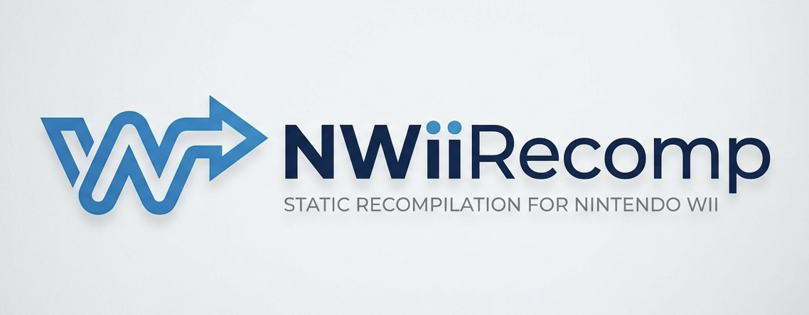

<p align="center">
  
</p>

<p align="center">
  Static recompilation toolkit for Nintendo Wii (Broadway/PowerPC) games.
</p>

<p align="center">
  Inspired by <a href="https://github.com/Mr-Wiseguy/N64Recomp">N64Recomp</a> and <a href="https://github.com/Ran-J/PS2Recomp">PS2Recomp</a>.
</p>

---

## What is this?

NWiiRecomp takes a Nintendo Wii game executable (`.dol`) and statically recompiles it into native C++ code. The result is a standalone binary that runs on modern hardware without an emulator.

This is not emulation. The game's logic runs as compiled native code. Hardware interaction (GX, OS, PAD, etc.) is handled by a thin high-level emulation (HLE) layer in the runtime.

The Wii's CPU (Broadway) is essentially an overclocked GameCube CPU (Gekko), both based on PowerPC 750CL. This means the same recompilation pipeline can eventually support GameCube (`.dol`/`.elf`) executables as well — the ISA is the same.

---

## Project Structure

```
NWiiRecomp/
├── nWiiAnalyzer/   — DOL/ELF parser and function boundary analyzer
├── nWiiRecomp/     — Offline static recompiler (PPC → C++)
├── nWiiRuntime/    — Cross-platform runtime + HLE library
└── nWiiStudio/     — GUI debugging and inspection tool (Raylib + ImGui)
```

---

## What Works

### Analyzer (`nWiiAnalyzer`)
- Full DOL section parsing (up to 7 text + 11 data sections)
- Recursive disassembly starting from the entry point
- Automatic discovery of function boundaries via branch analysis
- Function pointer recovery from data sections (vtables, jump tables)
- Hardcoded entry point hints for OS dispatch stubs that are computed at runtime via `lis`/`addi` patterns
- Discovered **16,600+** functions from a real Wii game

### Recompiler (`nWiiRecomp`)
- Translates PowerPC instructions to C++ that operates on a `CPUContext` struct
- Implemented instruction groups:
  - Integer arithmetic: `addi`, `addis`, `add`, `subf`, `mulli`, `mullw`, `divw`, `divwu`, `neg`
  - Logic: `and`, `or`, `xor`, `nor`, `nand`, `eqv`, `andc`, `orc`
  - Shifts/rotates: `slw`, `srw`, `sraw`, `srawi`, `rlwinm`, `rlwimi`, `rlwnm`
  - Loads/stores: `lwz`, `stw`, `lhz`, `sth`, `lbz`, `stb`, `lfs`, `stfs`, `lfd`, `stfd` (with update forms)
  - Floating point: `fadd`, `fsub`, `fmul`, `fdiv`, `fabs`, `fneg`, `fres`, `frsqrte`, `fmadd`, `fmsub`, `fnmadd`, `fnmsub`, `frsp`, `fctiw`, `fctiwz`
  - Compare: `cmp`, `cmpi`, `cmpl`, `cmpli`, `fcmpu`, `fcmpo`
  - Branches: `b`, `bl`, `bc`, `bcl`, `bclr`, `bclrl`, `bcctr`, `bcctrl` (all BO/BI combinations)
  - SPR access: `mfspr` / `mtspr` (LR, CTR, XER, SRR0, SRR1, HID0, HID2, WPAR, L2CR, GQR)
  - CR operations: `crand`, `crandc`, `cror`, `crorc`, `crxor`, `crnand`, `crnor`, `creqv`, `mcrf`, `mfcr`, `mtcrf`
  - System: `sc` (syscall), `rfi`, `sync`, `isync`, `eieio`, `dcbf`, `dcbst`, `dcbi`, `dcbz`, `icbi`
  - Paired-singles (GC/Wii SIMD extension): `psq_l`, `psq_st`, `ps_add`, `ps_sub`, `ps_mul`, `ps_div`, `ps_madd`, `ps_msub`, `ps_merge00/01/10/11`, `ps_sum0/1`, `ps_muls0/1`, `ps_nmadd/nmsub`, `ps_abs`, `ps_neg`, `ps_res`, `ps_rsqrte`, `ps_cmpu0/1`, `ps_cmpo0/1`
- Tail-call detection and correct `goto`-based inlining for local branches
- LK-bit handling: `ctx.lr` is set correctly before all call-type branches
- Mid-function entry point dispatch: functions with internal call/return targets expose a `switch(ctx.pc)` → `goto` prologue, allowing `run_game` to resume execution at any instruction after a return

### Runtime (`nWiiRuntime`)
- `CPUContext`: GPR[32], FPR[32], PS[32] (paired-singles), CR[8], LR, CTR, XER, SRR0/1, pc, FPSCR
- DOL loader: maps all text/data sections into host memory at the correct virtual addresses
- HLE stubs implemented:
  - **OSInit**, **OSReport**, **OSHalt**, **OSDisableInterrupts**, **OSEnableInterrupts**, **OSGetTime**, **OSCreateThread**, **OSResumeThread**
  - **GXInit**, **GXSetViewport**, **GXSetScissor**, **GXSetCullMode**, **GXSetZMode**, **GXSetBlendMode**, **GXSetColorUpdate**, **GXBegin**, **GXEnd**, **GXPosition3f32**, **GXColor4u8**
  - **PADInit**, **PADRead**, **WPADInit**, **WPADRead**
  - **MEMAllocFromMEMHeap**, **MEMFreeToMEMHeap**, memory arena management

### Studio (`nWiiStudio`)
- Raylib + ImGui-based GUI
- DOL file browser and loader
- Function list panel with address and instruction count
- Disassembly viewer (raw PPC hex + decoded mnemonic)
- Basic memory map view

---

## What's Next

- **More HLE coverage** — DVD, AX (audio), VI (video interface), EXI, SI
- **Memory model** — proper Wii ARAM / MEM1 / MEM2 layout, correct address translation
- **Paired-singles accuracy** — full GQR-based quantization for `psq_l`/`psq_st`
- **Exception vectors** — proper rfi/srr0 dispatch for interrupt handlers
- **Symbol import** — CSV/ELF symbol map support to name functions in output
- **GameCube support** — Broadway is Gekko overclocked; the ISA is identical, so GC `.dol` support is a natural follow-up
- **Wii U research** — longer term, not a priority

---

## Building

**Requirements:** CMake 3.20+, a C++20 compiler, internet access (Raylib is fetched automatically).

```bash
cmake -B build
cmake --build build -j$(nproc)
```

---

## Usage

```bash
# 1. Analyze and recompile the game DOL
./build/nWiiRecomp/nwiirecomp path/to/game.dol path/to/symbols.csv

# 2. Build the generated project
cd export
cmake -B build
cmake --build build -j$(nproc)

# 3. Run
./build/RecompiledGame
```

The recompiler outputs a self-contained `export/` directory containing `output.cpp` and a copy of `nWiiRuntime`. It can be built independently without the rest of this repository.

---

## References

- [WiiBrew](https://wiibrew.org/) — Wii hardware and software documentation
- [YAGCD — Yet Another GameCube Documentation](https://hitmen.c02.at/files/yagcd/) — Low-level GC/Wii CPU and hardware reference
- [PowerPC 750CL User's Manual](https://www.nxp.com/docs/en/user-guide/750CLSUM.pdf) — Official ISA reference
- [N64Recomp](https://github.com/Mr-Wiseguy/N64Recomp) — Original inspiration for the static recompilation approach
- [PS2Recomp](https://github.com/Ran-J/PS2Recomp) — Structural reference for the project layout

---

## License

MIT License. See [LICENSE](LICENSE) for details.  
© 2026 Vova Vovchok.

> **Disclaimer:** This project contains no copyrighted Nintendo code, SDKs, or game data. You must provide your own legally obtained game executables.
