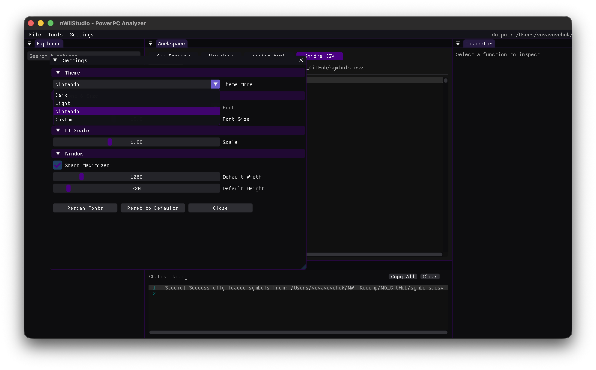

Static recompilation toolkit for Nintendo Wii (Broadway/PowerPC) games.

Inspired by <a href="https://github.com/Mr-Wiseguy/N64Recomp">N64Recomp</a> and <a href="https://github.com/Ran-J/PS2Recomp">PS2Recomp</a>.

## What is this?
NWiiRecomp takes a Nintendo Wii game executable (`.dol`) and statically recompiles it into native C++ code. The result is a standalone binary that runs on modern hardware without an emulator.
This is not emulation. The game's logic runs as compiled native code. Hardware interaction (GX, OS, PAD, etc.) is handled by a thin high-level emulation (HLE) layer in the runtime.
The Wii's CPU (Broadway) is essentially an overclocked GameCube CPU (Gekko), both based on PowerPC 750CL. This means the same recompilation pipeline can eventually support GameCube (`.dol`/`.elf`) executables as well — the ISA is the same.
## Project Structure
## What Works
### Analyzer (`nWiiAnalyzer`)
- Full DOL section parsing (up to 7 text + 11 data sections)
- Recursive disassembly starting from the entry point
- Automatic discovery of function boundaries via branch analysis
- Function pointer recovery from data sections (vtables, jump tables)
- Hardcoded entry point hints for OS dispatch stubs that are computed at runtime via `lis`/`addi` patterns
- Discovered ~38,400+ functions from a "Silent Hill SM" Wii
### Recompiler (`nWiiRecomp`)
- Translates PowerPC instructions to C++ that operates on a `CPUContext` struct
- Implemented instruction groups:
- Integer arithmetic: `addi`, `addis`, `add`, `subf`, `mulli`, `mullw`, `divw`, `divwu`, `neg`
- Logic: `and`, `or`, `xor`, `nor`, `nand`, `eqv`, `andc`, `orc`
- Shifts/rotates: `slw`, `srw`, `sraw`, `srawi`, `rlwinm`, `rlwimi`, `rlwnm`
- Loads/stores: `lwz`, `stw`, `lhz`, `sth`, `lbz`, `stb`, `lfs`, `stfs`, `lfd`, `stfd` (with update forms)
- Floating point: `fadd`, `fsub`, `fmul`, `fdiv`, `fabs`, `fneg`, `fres`, `frsqrte`, `fmadd`, `fmsub`, `fnmadd`, `fnmsub`, `frsp`, `fctiw`, `fctiwz`
- Compare: `cmp`, `cmpi`, `cmpl`, `cmpli`, `fcmpu`, `fcmpo`
- Branches: `b`, `bl`, `bc`, `bcl`, `bclr`, `bclrl`, `bcctr`, `bcctrl` (all BO/BI combinations)
- SPR access: `mfspr` / `mtspr` (LR, CTR, XER, SRR0, SRR1, HID0, HID2, WPAR, L2CR, GQR)
- CR operations: `crand`, `crandc`, `cror`, `crorc`, `crxor`, `crnand`, `crnor`, `creqv`, `mcrf`, `mfcr`, `mtcrf`
- System: `sc` (syscall), `rfi`, `sync`, `isync`, `eieio`, `dcbf`, `dcbst`, `dcbi`, `dcbz`, `icbi`
- Paired-singles (GC/Wii SIMD extension): Full support for `ps_add`, `ps_sub`, `ps_mul`, `ps_madd`, `ps_merge`, etc. High-accuracy implementation of `psq_l` and `psq_st` utilizing GQR-based quantization scales directly into C++ intrinsic floats.
- Tail-call detection and correct `goto`-based inlining for local branches
- LK-bit handling: `ctx.lr` is set correctly before all call-type branches
- Mid-function entry point dispatch: functions with internal call/return targets expose a `switch(ctx.pc)` → `goto` prologue, allowing `run_game` to resume execution at any instruction after a return
### Runtime (`nWiiRuntime`)
- Multithreaded Architecture: CPU execution runs in a dedicated background thread, completely decoupled from the host's GPU/Window thread, preventing context-loss segfaults and synchronization deadlocks.
- Hardware-Accurate MMU:
- Strict Virtual-to-Physical address translation (BAT simulation) mapping `0x80...` (cached) and `0xC0...` (uncached) to physical MEM1 `0x00...`.
- Accurate BSS section initialization to prevent global variable corruption.
- RVL_SDK Memory Allocator: True guest-backed HLE heap management (`OSAllocFromHeap`). Writes actual 32-byte headers (`0x7373` / `0x4652` magics) into guest memory, surviving strict `OSCheckHeap` validations used by retail games.
- Asynchronous Callback Dispatcher: Hardware interrupts and async HLE callbacks (DVD, IOS) are queued and executed safely between instruction blocks, completely eliminating C++ stack overflows caused by synchronous tail-recursion.
- Strict GX Command Processor (GPU):
- Thread-safe FIFO ring buffer for `WGPIPE` (`0xCC008000`) commands.
- Dolphin-accurate Command Processor (CP) parser with Vertex Attribute Table (VAT) tracking.
- Emulates GameCube/Wii fixed-function pipeline using a custom TEV Uber-Shader (GLSL).
- Zero-Latency Gamepad Input: Host inputs are polled once per frame by the main thread and cached. The CPU thread reads this cache natively, avoiding OS-level input polling bottlenecks during game loops.
- TOML Configuration: Fully integrated `tomlplusplus` config setup allows dynamic targeting of the host platform (`GameCube` or `Wii`), graphical toggles, and bypassing of OS sub-systems.
### Studio (`nWiiStudio`)
- Raylib + ImGui-based GUI
- DOL file browser and loader
- Function list panel with address and instruction count
- Disassembly viewer (raw PPC hex + decoded mnemonic)
- Basic memory map view
- Settings & Config Integration: Direct integration with `reconfig.toml` to manage paths cleanly.
- Premium Themes: Includes "Nintendo" theme (GameCube Indigo / Wii aesthetic) for a polished user experience.

## What's Next
- Wii U (Cafe OS) Extension: The Wii U's Espresso CPU is fully backwards compatible with the PowerPC 750CL ISA. Instead of building a separate recompiler, NWiiRecomp will be extended to support Wii U `.rpx`/`.rpl` formats by adding SMP (multi-core) SPRs, Page Table (TLB) virtual memory handling, and an HLE layer translating GX2 (AMD PM4) packets to Vulkan.
- Dynamic VAT Generation: Compiling specific GLSL/Vulkan shaders on the fly based on the game's Vertex Attribute Table state to optimize the GX pipeline.
- More HLE coverage — AX (audio DSP microcode translation), EXI, and SI timing accuracy.
## Building
Requirements: CMake 3.20+, a C++20 compiler, internet access (Raylib is fetched automatically).
## Usage
The recompiler outputs a self-contained `export/` directory containing `output.cpp` and a copy of `nWiiRuntime`. It can be built independently without the rest of this repository.
## References

- [Dolphin Emulator](https://github.com/dolphin-emu/dolphin) — Huge thanks for the endless hardware documentation, GX/DSP accuracy, and HLE inspiration!
- [Cemu](https://github.com/cemu-project/Cemu.git) — Reference for Cafe OS RPL imports, hardware emulation, and GX2 to Vulkan translation.
- [Decaf-emu](https://github.com/decaf-emu/decaf-emu.git) — Great resource for RPX/RPL loaders and Cafe OS kernel/syscalls.
- [WiiUBrew](https://wiiubrew.org/wiki/Hardware/GX2) — Excellent Wii U GX2 and Cafe OS documentation.
- [CafeGLSL](https://github.com/Exzap/CafeGLSL.git) — Open-source shader compiler alternative, crucial for understanding GX2 shaders.
- [rpl2elf](https://github.com/Relys/rpl2elf.git) — Useful for RPX/RPL to ELF conversion and parsing.
- [GhidraRPXLoader](https://github.com/decaf-emu/GhidraRPXLoader.git) — RPX loader logic.
- WiiBrew — Wii hardware and software documentation
- YAGCD — Yet Another GameCube Documentation — Low-level GC/Wii CPU and hardware reference
- PowerPC 750CL User's Manual — Official ISA reference
- N64Recomp — Original inspiration for the static recompilation approach
- PS2Recomp — Structural reference for the project layout

## License

MIT License. See LICENSE for details.
© 2026 Vova Vovchok.
