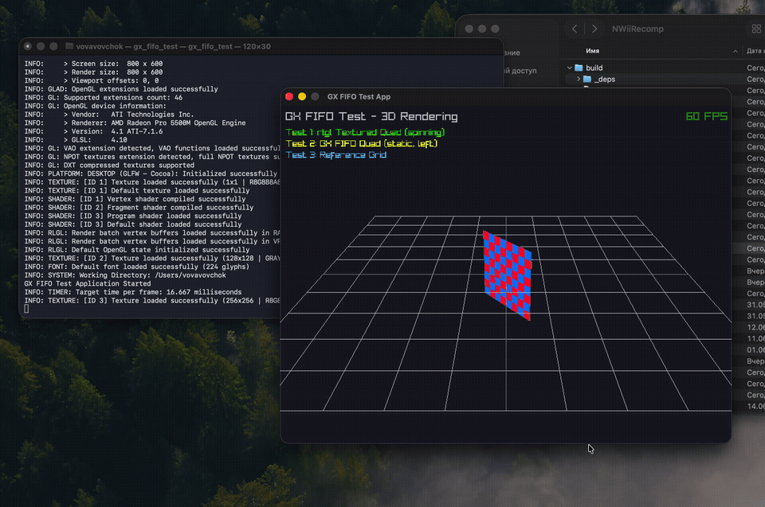
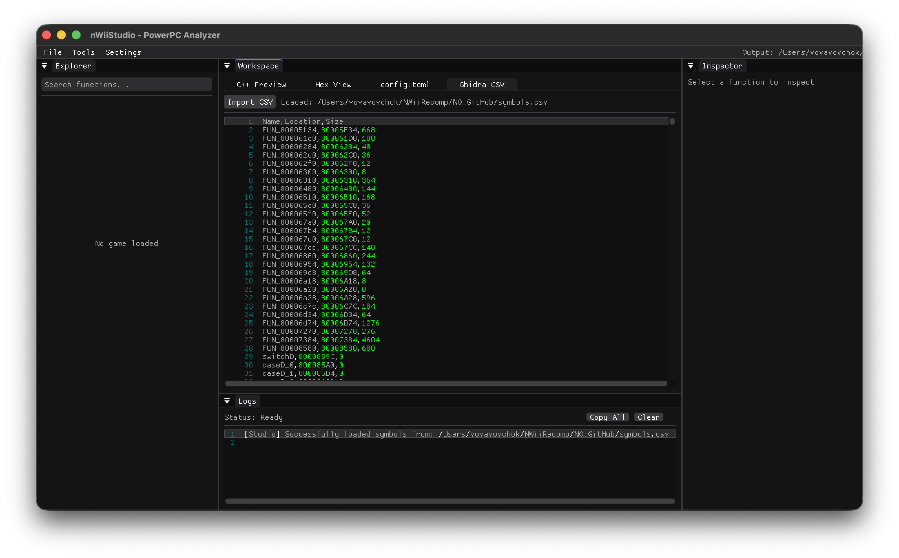
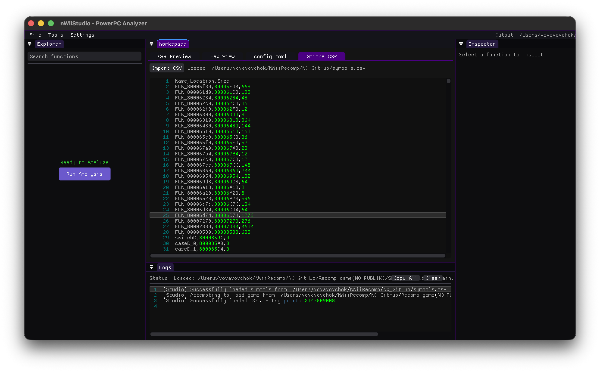
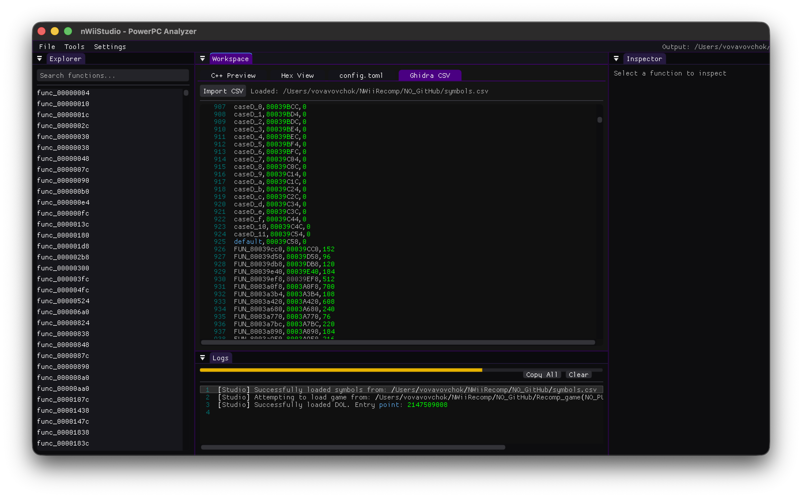

<p align="center">
  
</p>

<p align="center">
  Static recompilation and runtime toolkit for Nintendo GameCube, Wii, and Wii U executables.
</p>

<p align="center">
(The first recompiler that really works)
</p>

<p align="center">
  <a href="https://youtube.com/@blacklineinteractive">
    
  </a>
</p>

---

## What is this?

NWiiRecomp translates Nintendo Wii/GameCube (`.dol`, `.elf`) and Wii U (`.rpx`, `.rpl`) executables into native C++ code. The output is a standalone executable that runs natively without instruction-level emulation. Hardware interactions are handled by a High-Level Emulation (HLE) runtime layer.

---

## Project Structure

```
NWiiRecomp/
├── nWiiAnalyzer/   — DOL/ELF parser and function boundary analyzer
├── nWiiRecomp/     — Offline static recompiler (PPC → C++)
├── nWiiRuntime/    — Cross-platform runtime + HLE library
└── nWiiStudio/     — GUI debugging and inspection tool (Raylib + ImGui)
```

---

## What Works

### Analyzer (`nWiiAnalyzer`)

- Full DOL section parsing.
- Recursive disassembly from entry point.
- Branch analysis for function boundary discovery.
- Vtable and jump table pointer recovery.
- Heuristics for OS dispatch stubs (via `lis`/`addi` patterns).

### Recompiler (`nWiiRecomp`)

- Translates PowerPC 750CL instructions to C++.
- Implements core integer, logic, floating point, branch, and SPR instructions.
- Implements paired-singles (SIMD) with GQR-based quantization scales mapped to C++ intrinsics.
- Tail-call detection and `goto`-based local branch inlining.
- Mid-function entry point dispatch via `switch(ctx.pc)`.

### Runtime (`nWiiRuntime`)

<p align="center">
  
</p>
<p align="center">
  
</p>

- **Configuration**: Per-game TOML profiles via `tomlplusplus` for target platform and overrides.
- **Input**: Raylib gamepad API integration mapped to `PADStatus`.
- **GX Graphics**: Structure tracking and WGPIPE ring-buffer parsing.
- **Memory**: DOL loading and virtual memory mapping.
- **Wii U / Cafe OS**: Initial RPX loading, ELF parsing, and Latte GPU PM4 packet handling.
- **HLE Stubs**: Basic implementations for OS, GX, PAD, WPAD, MEM, and IOS subsystems.

### Studio (`nWiiStudio`)

- Raylib + ImGui-based GUI
- DOL file browser and loader
- Function list panel with address and instruction count
- Disassembly viewer (raw PPC hex + decoded mnemonic)
- Basic memory map view
- **Settings & Config Integration**: Direct integration with `recomp_config.toml` to manage paths cleanly.
- **Thematic Themes**: Includes "Nintendo" theme (GameCube Indigo / Wii aesthetic) for a polished user experience.

<p align="center">
  
  &nbsp;
  
  &nbsp;
  
  &nbsp;
  
</p>

---

## What's Next

Current refactoring plan execution:

- **Phase 1**: IOS Device Interface abstraction - done!
- **Phase 2**: MMIO dispatcher table - done!
- **Phase 3**: IPlatform factory (GC, Wii, Wii U).
- **Phase 4**: Separation of GX FIFO parsing and rendering.
- **Phase 5**: Universal Input framework (Wiimote/Gyro/WebSocket).
- **Phase 6**: Wii U coreinit.rpl HLE and GX2 API translation.

---

## Building

**Requirements:** CMake 3.20+, a C++20 compiler, internet access (Raylib is fetched automatically).

```bash
cmake -B build
cmake --build build -j$(nproc)
```

---

## Usage

```bash
# 1. Analyze and recompile the game DOL
./build/nWiiRecomp/nwiirecomp path/to/game.dol path/to/symbols.csv

# 2. Build the generated project
cd export
cmake -B build
cmake --build build -j$(nproc)

# 3. Run
./build/RecompiledGame
```

The recompiler outputs a self-contained `export/` directory containing `output.cpp` and a copy of `nWiiRuntime`. It can be built independently without the rest of this repository.

---

- [N64Recomp](https://github.com/N64Recomp/N64Recomp) — Original inspiration for the static recompilation approach
- [Dolphin Emulator](https://github.com/dolphin-emu/dolphin) — Huge thanks for the endless hardware documentation, GX/DSP accuracy, and HLE inspiration!
- [Cemu](https://github.com/cemu-project/Cemu.git) — Reference for Cafe OS RPL imports, hardware emulation, and GX2 to Vulkan translation.
- [Decaf-emu](https://github.com/decaf-emu/decaf-emu.git) — Great resource for RPX/RPL loaders and Cafe OS kernel/syscalls.
- [WiiUBrew](https://wiiubrew.org/wiki/Hardware/GX2) — Excellent Wii U GX2 and Cafe OS documentation.
- [CafeGLSL](https://github.com/Exzap/CafeGLSL.git) — Open-source shader compiler alternative, crucial for understanding GX2 shaders.
- [rpl2elf](https://github.com/Relys/rpl2elf.git) — Useful for RPX/RPL to ELF conversion and parsing.
- [GhidraRPXLoader](https://github.com/decaf-emu/GhidraRPXLoader.git) — RPX loader logic.
- [WiiBrew](https://wiibrew.org/wiki/Main_Page) — Wii hardware and software documentation
- [YAGCD](https://hitmen.c02.at/files/yagcd/) — Yet Another GameCube Documentation — Low-level GC/Wii CPU and hardware reference
- PowerPC 750CL User's Manual — Official ISA reference

---

## License

License. See [LICENSE](LICENSE) for details.  
© 2026 Volodymyr Vovchok.

> **Disclaimer:** This project contains no copyrighted Nintendo code, SDKs, or game data. You must provide your own legally obtained game executables.
