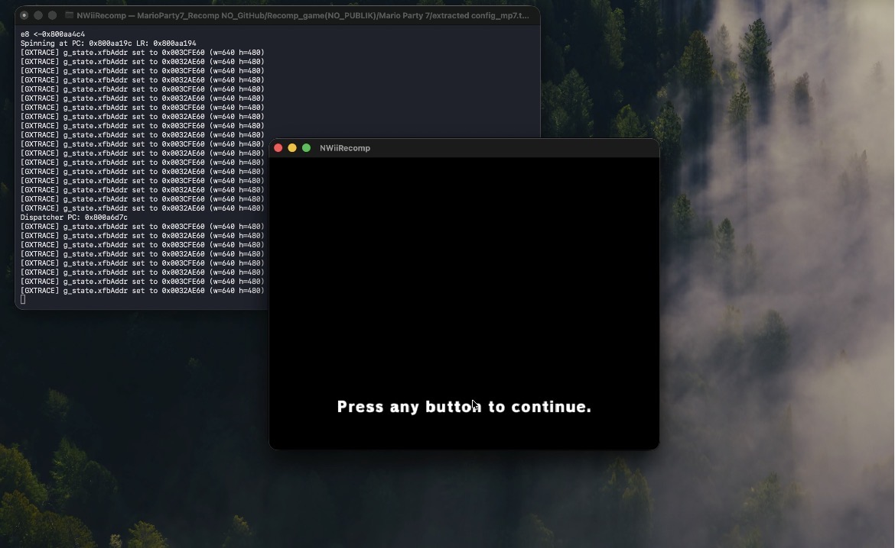

# NWiiRecomp Media Showcase

This document showcases the development progress, tools, and runtime execution of **NWiiRecomp**.

---

## 🎮 Mario Party 7 — In-Game Rendering

The first GC game to successfully boot, stream from DVD, parse GX display lists, decode hardware textures, and render to screen — running **natively** via static recompilation, with **zero instruction-level emulation**.

  

  <i>Health &amp; Safety screen — correctly positioned, full-resolution, stable frame output.</i>

  

---

## nWiiRuntime in Action

The **Runtime** layer translates hardware interactions (HLE) and handles the graphics FIFO and memory management.

  

---

## nWiiStudio Interface

**nWiiStudio** is a comprehensive GUI tool built with Raylib and ImGui. It's used for DOL/ELF inspection, memory viewing, and function analysis.

### Disassembly & Function Analysis

  

### Settings & Configuration

  

  

  

---

[Return to README](README.md)
